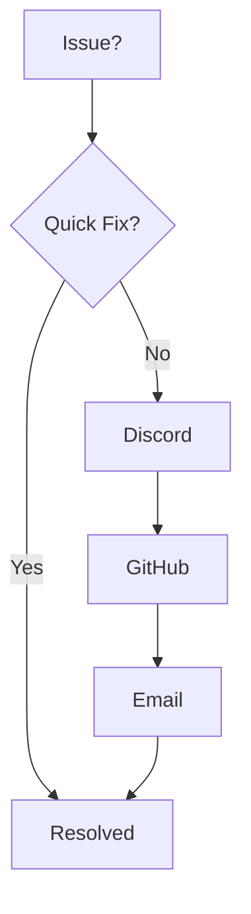

## Overview

Feiyu Liang Documentation helps you organize project docs efficiently. Find answers to common account, billing, troubleshooting, best practices, and support questions below. Use the expandable sections for detailed responses.

<Callout kind="info">
  Check your dashboard first for personalized account info.
</Callout>

## Account and Billing Queries

<ExpandableGroup>

<Expandable title="How do I create an account?">

Visit `https://feiyuliang.com` and click **Sign Up**. Enter your email, create a password, and verify via the confirmation link. You gain instant access to the free tier.

</Expandable>

<Expandable title="What payment methods do you accept?">

We support credit cards (Visa, Mastercard), PayPal, and Stripe. Update methods in **Account > Billing**.

</Expandable>

<Expandable title="How do I upgrade my plan?">

Go to **Account > Billing > Upgrade**. Select Pro or Enterprise, enter payment details, and confirm. Changes apply immediately.

| Plan     | Price/Month | Features                  |
|----------|-------------|---------------------------|
| Free     | $0         | 5 pages, basic editing    |
| Pro      | $19        | Unlimited pages, custom domains |
| Enterprise | $99     | Teams, SSO, priority support |

</Expandable>

<Expandable title="Can I cancel anytime?">

Yes, cancel via **Account > Billing > Cancel Subscription**. No penalties, access continues until billing cycle ends.

</Expandable>

</ExpandableGroup>

## Troubleshooting Common Issues

<Callout kind="tip">
  Clear browser cache and refresh before advanced steps.
</Callout>

<Tabs>

<Tab title="Page Not Loading" icon="alert-triangle">

1. Check internet connection.
2. Disable ad blockers.
3. Try incognito mode.

```bash
# Test connectivity
ping feiyuliang.com
```

</Tab>

<Tab title="Edit Mode Broken" icon="edit-3">

<Steps>

<Step title="Refresh Editor" icon="refresh-cw">

Press `Ctrl+R` (`Cmd+R` on macOS).

</Step>

<Step title="Check Console" icon="bug">

Open DevTools (`F12`), view **Console** tab for errors.

</Step>

<Step title="Reset Workspace">

Click **Workspace > Reset**.

```javascript
// Common fix: Clear local storage
localStorage.clear();
location.reload();
```

</Step>

</Steps>

</Tab>

<Tab title="Search Not Working" icon="search">

Update your index:

<CodeGroup tabs="CLI,Dashboard">

```bash
# Command line
feiyu-docs rebuild-index
```

```javascript
// Dashboard script
await docs.reindex();
```

</CodeGroup>

</Tab>

</Tabs>

## Best Practices for Documentation

Follow these steps to maintain high-quality docs.

<Steps>

<Step title="Structure Content" icon="layout">

Use H2 for sections, H3 for subsections. Start every page with frontmatter.

</Step>

<Step title="Add Components" icon="puzzle">

Incorporate `<Columns>`, `<Tabs>`, and `<Steps>` for engagement.

<CodeGroup tabs="MDX,Example">

````mdx
// Proper MDX structure
<Columns cols={2}>
  <Card title="Feature 1" icon="star" href="/feature1" />
</Columns>
````

```mdx
// Usage example
<Tabs>
  <Tab title="Node.js">Code here</Tab>
</Tabs>
```

</CodeGroup>

</Step>

<Step title="Version Control" icon="git-branch">

Commit changes frequently with descriptive messages.

```bash
git add docs/
git commit -m "Update FAQ with troubleshooting tabs"
git push origin main
```

</Step>

<Step title="SEO Optimize" icon="search">

Add meta descriptions and use keywords naturally.

</Step>

</Steps>

## Support Resources

<Columns cols={3}>

<Card title="Community Discord" icon="message-circle" href="https://discord.gg/feiyuliang" target="_blank">

Join 5K+ members for real-time help.

</Card>

<Card title="GitHub Issues" icon="github" href="https://github.com/feiyuliang/docs/issues" target="_blank">

Report bugs or request features.

</Card>

<Card title="Email Support" icon="mail" href="mailto:support@feiyuliang.com">

For Pro/Enterprise users only.

</Card>

</Columns>



<Callout kind="success">
  Most issues resolve in Discord within hours.
</Callout>