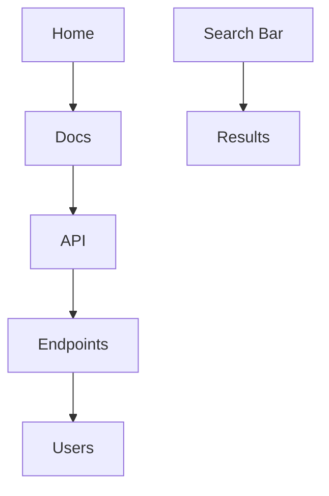

## Overview

Feiyu Liang Documentation provides powerful tools to streamline your documentation workflow. You organize content hierarchically, edit with rich formatting, collaborate in real-time, and navigate efficiently. These core features help you build professional docs quickly.

<Columns cols={2}>
  <Card title="Document Organization" icon="folder" href="#document-organization">
    Structure your docs with folders, pages, and navigation menus.
  </Card>
  <Card title="Editing Tools" icon="edit-3" href="#editing-tools">
    Format content using Markdown and MDX components.
  </Card>
  <Card title="Collaboration" icon="users" href="#collaboration">
    Invite team members and review changes together.
  </Card>
  <Card title="Search & Navigation" icon="search" href="#search-navigation">
    Find content instantly with full-text search and breadcrumbs.
  </Card>
</Columns>

## Document Organization

Organize your documentation into a clear hierarchy. Create folders to group related pages, set custom navigation menus, and use frontmatter for metadata.

<Steps>
  <Step title="Create Folders" icon="folder-plus">
    In the sidebar, click the new folder icon and name it `api-reference`.
  </Step>
  <Step title="Add Pages" icon="file-plus">
    Right-click a folder and select "New Page". Use YAML frontmatter like this:
    
    ````markdown
    ```yaml
    ---
    title: API Endpoints
    description: All available API routes
    ---
    ```
    ````
  </Step>
  <Step title="Customize Navigation" icon="menu">
    Drag pages in the outline editor to reorder. Enable auto-generated sidebars for nested structures.
  </Step>
</Steps>

## Editing and Formatting Tools

Edit documents with Markdown and embed interactive MDX components. Preview changes live and use syntax highlighting for code blocks.

<Tabs>
  <Tab title="Basic Formatting" icon="type">
    Use standard Markdown:
    
    ```markdown
    # Heading
    **Bold text**
    `Inline code`
    - List item
    ```
  </Tab>
  <Tab title="MDX Components" icon="code">
    Add components like this:
    
    <CodeGroup tabs="Callout,Card">
    ````jsx
    <Callout kind="info">
      This is a note.
    </Callout>
    ````
    ````jsx
    <Card title="Feature" icon="star" href="/docs">
      Learn more.
    </Card>
    ````
    </CodeGroup>
  </Tab>
</Tabs>

<Callout kind="tip">
  Enable live preview in settings to see component rendering as you type. Use `{title: "Value"}` in frontmatter for dynamic pages.
</Callout>

## Collaboration Features

Collaborate seamlessly with your team. Share edit access, track changes, and discuss via comments.

<ExpandableGroup>
  <Expandable title="Invite Collaborators" default-open="true">
    Go to workspace settings, enter emails, and assign roles: admin, editor, or viewer. Changes sync in real-time.
  </Expandable>
  <Expandable title="Review Changes">
    View version history and compare diffs. Resolve conflicts with merge tools.
  </Expandable>
</ExpandableGroup>

| Feature | Description | Permissions |
|---------|-------------|-------------|
| Real-time Editing | Multiple users edit simultaneously | Editors+ |
| Comments | Inline feedback on sections | All users |
| Version History | Rollback to previous versions | Admins |
| Notifications | Email alerts for mentions | Configurable |

## Search and Navigation

Navigate your docs effortlessly. Use global search with fuzzy matching and structured breadcrumbs.



<Callout kind="success">
  Search indexes all content automatically. Use filters for pages, code, or headings.
</Callout>