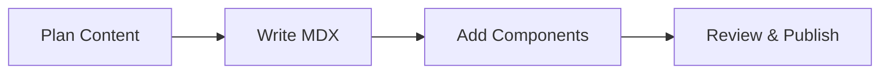

## Overview

Feiyu Liang Documentation provides a centralized platform where you organize, manage, and publish all your project documentation. Build structured knowledge bases with MDX-powered pages, collaborative editing, and seamless version control. Access powerful components like Cards, Steps, and Tabs to create engaging docs that scale with your projects.

<Callout kind="info">
  Start creating pages immediately—no setup required. Use the brand color `{`#3B82F6`}` for consistent theming.
</Callout>

## Core Purpose and Benefits

You gain a single source of truth for technical docs, API references, and user guides. Key benefits include intuitive MDX authoring, real-time collaboration, automatic search, and custom branding.

<Columns cols={3}>
  <Card title="Structured Organization" icon="layers" href="#">
    Nest pages hierarchically and use frontmatter for metadata.
  </Card>
  <Card title="Rich Components" icon="components" href="#">
    Embed Steps, Tabs, and CodeGroup for interactive content.
  </Card>
  <Card title="Fast Publishing" icon="rocket" href="#">
    Preview changes live and deploy with one click.
  </Card>
</Columns>

## Getting Started

Follow these steps to launch your first documentation site.

<Steps>
  <Step title="Create a Workspace" icon="plus">
    Sign up and create a new workspace for your project. Name it after your repository, like `feiyu-liang-docs`.
  </Step>
  <Step title="Add Your First Page" icon="file-text">
    Click "New Page" and select `introduction.mdx`. Add YAML frontmatter at the top.
  </Step>
  <Step title="Write with Components" icon="edit-3">
    Use H2 headings and components like `<Columns>`. Preview renders instantly.
  </Step>
  <Step title="Publish and Share" icon="globe">
    Hit publish to generate a live site at `your-site.feiyuliangdocs.com`.
  </Step>
</Steps>

<CodeGroup tabs="MDX Frontmatter,Bash Setup">
  ```yaml
  ---
  title: My Page
  description: Page summary here.
  ---
  ```
  ```bash
  npm install feiyu-liang-docs-cli
  feiyu init my-docs
  feiyu build
  ```
</CodeGroup>

## Brand Guidelines

Maintain consistency across your docs with these guidelines.

<Tabs>
  <Tab title="Colors" icon="palette">
    Primary: `{`#3B82F6`}`  
    Secondary: `{`#1E40AF`}`  
    Use hex codes in CSS: `color: #3B82F6;`
  </Tab>
  <Tab title="Typography" icon="type">
    Headings: Inter font, bold weights.  
    Body: 16px base size.  
    Avoid more than H4 levels.
  </Tab>
  <Tab title="Icons" icon="star">
    Use Lucide icons like `zap`, `shield`.  
    Reference: [Lucide.dev](https://lucide.dev/icons/)
  </Tab>
</Tabs>



## Frequently Asked Questions

<ExpandableGroup>
  <Expandable title="How do I customize themes?" default-open="true">
    Edit workspace settings to apply your brand color `{`#3B82F6`}` and logos. Changes propagate site-wide.
  </Expandable>
  <Expandable title="Can I integrate with Git?">
    Connect your GitHub repo for versioned edits and pull requests.
  </Expandable>
  <Expandable title="What about SEO?">
    Frontmatter generates meta tags automatically. Add `slug` for custom URLs.
  </Expandable>
</ExpandableGroup>

Explore features like API docs with `<ParamField>` or changelogs using `<Update>`. Your documentation evolves with your project.